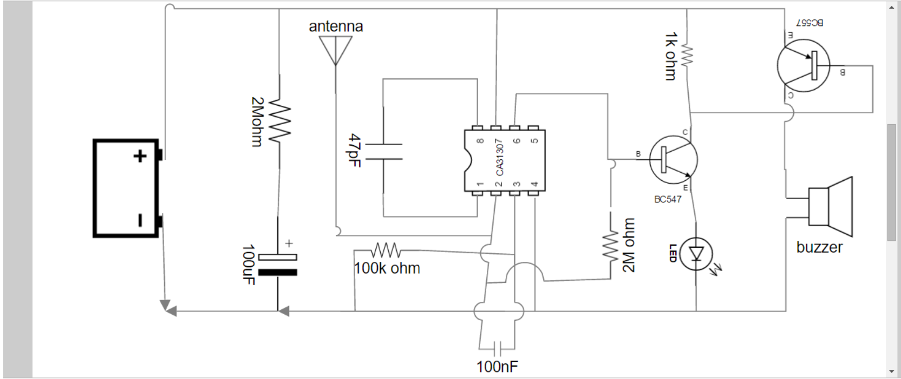

## Mobile Signal Detector 
As increase in the technology in the world using the electronic equipment’s are being used in the wrong way like in the examination halls and in the confidential room. To avoid this we are introducing a project called MOBILE PHONE DETECTOR.
This handy, pocket-size mobile transmission detector or sniffer can sense the presence of an activated mobile cell phone from a distance of one and-a-half meters. So it can be used to
prevent use of mobile phones in examination halls, confidential rooms, etc. It is also useful for detecting the use of mobile phone for Spying and unauthorized video transmission. The circuit
can detect the incoming and outing calls, even if the mobile phone is kept in the silent mode. The moment the Bug detects RF transmission signal from an activated mobile phone, it starts sounding a beep alarm and the LED blinks. The alarm continues to beep until the signal

# Problem Statement

- Previously, there was no technology to detect the cell phones in the examination hall and in cell phone restricted areas. There is manual checking and there is still a chance of having the cell phone with the person if he is not checked properly. So to avoid this problem, an automatic
detection of cell phone is introduced.
# Circuit Diagram
images/Circuit Diagram.png

